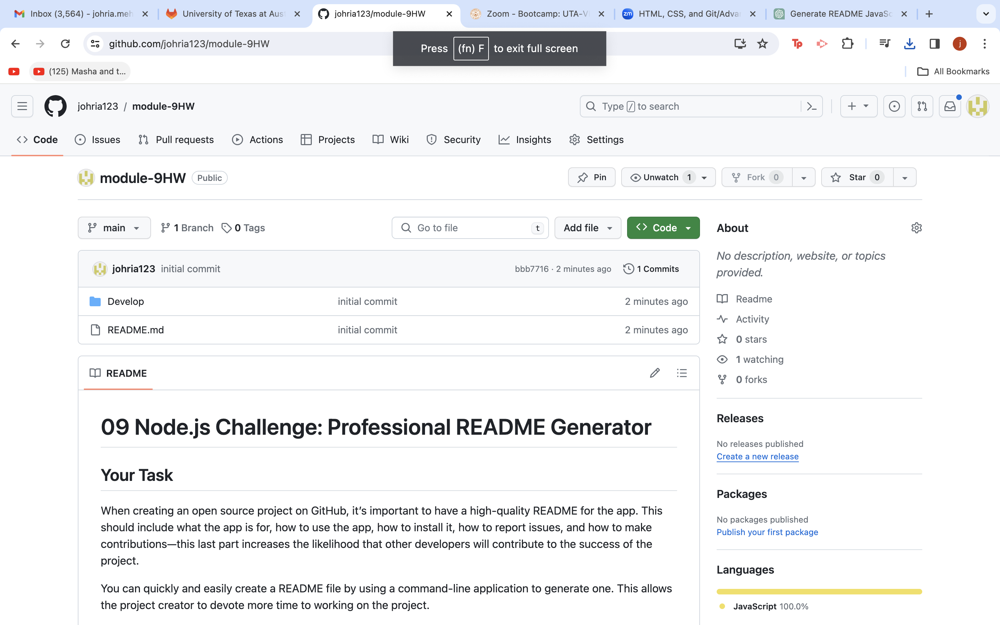

# README Generator
  
## Description
This project was based on creating a README.md file where there is a title, description, installation instructions, ususage information, contribution guidelinesand test instructions. Along with that a license is included, alos a GitHub username is entered which will take the users GitHub profile. 

## Table of Contents
- [Installation](#installation)
- [Features](#features)
- [Questions](#questions)

## Installation
    1. clone the repository
    2. install dependencies
    3. start the application

## Features
- .gitihnore
- JavaScript
- Index.js
- GItHub
- package.json
 
## Questions
For any questions, please contact [johria.mehboob@gmail.com].

[do not forget to visit my page to view the application] (https://github.com/johria123/module-9HW)